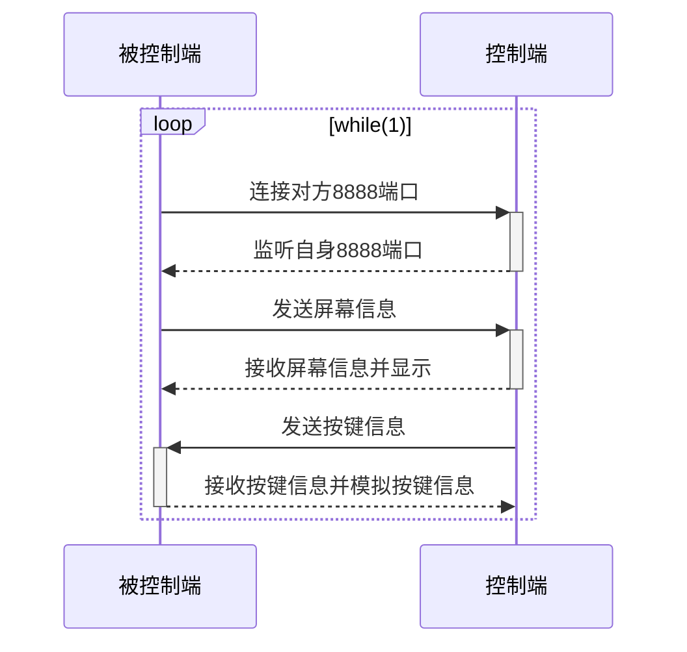

```mermaid
sequenceDiagram
	loop while(1)
		被控制端 ->> + 控制端: 连接对方8888端口
		控制端 -->> - 被控制端: 监听自身8888端口

		被控制端 ->> + 控制端: 发送屏幕信息
		控制端 -->> - 被控制端: 接收屏幕信息并显示

		控制端 ->> + 被控制端: 发送按键信息
		被控制端 -->> - 控制端: 接收按键信息并模拟按键信息
	end
```

TODO：
控制端的鼠标使用的是全局的位置信息，需要对显示窗口上的位置进行变换达到让鼠标出现在被控制端的相应位置
内网穿透

